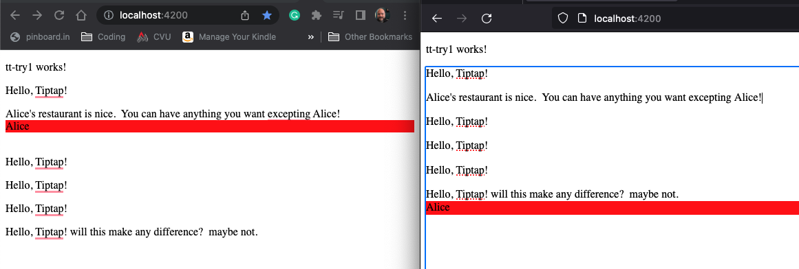

I'm learning a bit about [CRDT](https://en.wikipedia.org/wiki/Conflict-free_replicated_data_type)
because it's shiny. And I want to give a ToastMasters' talk about it at 
TechTalkers.org in a few weeks.  Maybe a lunch and learn too.

This repo as of 28-Nov-2022 replicates some of the stuff that is demonstrated 
in this excellent video: https://www.youtube.com/watch?v=VcnROkRhJ34&t=555s 

Here's a screen grab of the angular app running in chrome and firefox.  The collaboration cursor is shown in both.

